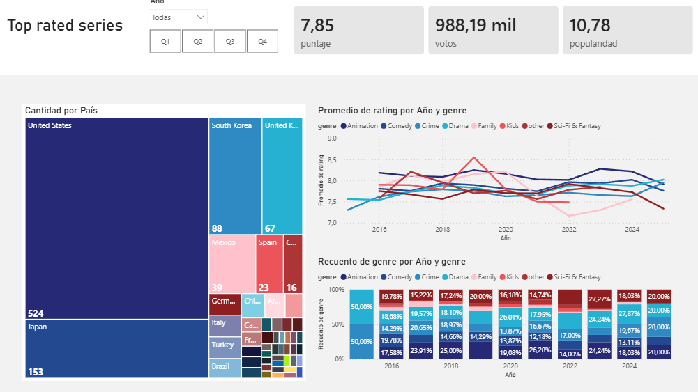

# Analisis top 2000 series de TV (TMDB)

## Objetivo del proyecto
Identificar si existe una tendencia en los generos de las series mejor evaluadas por la audiencia historicamente y si existen grupos de series que desempeñan mejor. De esta manera se puede recomendar ciertos grupos de series los cuales serian ideales para partir una nueva plataforma de streaming.

## Dataset utilizado 

* **Dataset Original:** [`top_rated_2000webseries.csv`](https://github.com/morbul/data_analyst_dashboard/blob/main/top_rated_2000webseries.csv) - Contiene los datos crudos extraídos de la fuente original sin modificaciones.
* **Dataset Procesado:** [`tv_series_clean.csv`](https://github.com/morbul/data_analyst_dashboard/blob/main/tv_series_clean.csv) - Es el resultado de la limpieza realizada en Python, el cual incluye la columna `primary_genre` y es el archivo que alimenta directamente el panel de Power BI.

## Preguntas (KPIS) 

* ¿Que paises producen mejores series?.
* ¿Existe un cambio en la proporcion de los generos de las series mejor evaluadas en los últimos años?.
* ¿Si deseo partir solo con un genero en especifico hay alguno que destaque sobre los demás?.

## Proceso de limpieza y transformación de los datos
Este proceso fue realizado en Python
1. Identificación y manejo de valores nulos: de la totalidad de los registros solo faltaban 21 datos donde 20 de estos corresponden a la descripcion de las series y el restante un pais de origen para un registro
2. Normalización de Géneros: dado que cada serie puede tener multiples generos se establece una jerarquia de generos para determinar un genero principal de cada una de la series analizadas, esto se establece atraves de la frecuencia de estos generos de esta manera el genero principal queda de la forma Kids > Animation > Family > SciFy & Fantasy > Comedy > Crime > Drama

## Dashboard 

